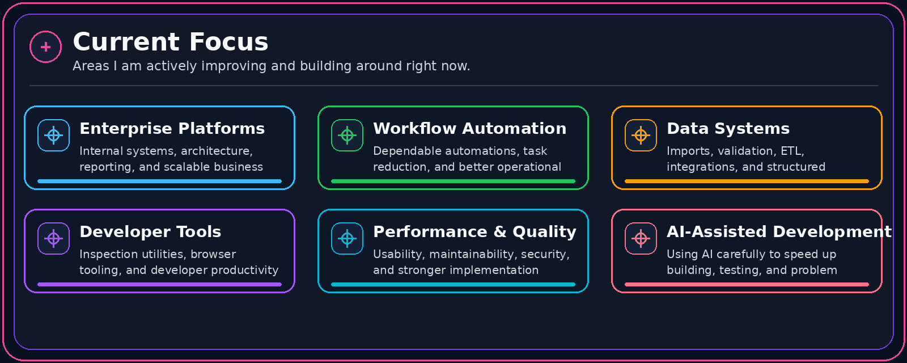

 

## About Me

I am a software developer from Puerto Rico focused on building useful, maintainable, and data-driven applications.

My work combines web development, automation, databases, browser tools, reporting, and internal operational platforms. I enjoy transforming repetitive or disorganized processes into systems that are easier to use, monitor, and improve.

<table>
  <tr>
    <td align="center" width="25%">
      <strong>Problem Solver</strong>  
      Turning complex workflows into clear solutions.
    </td>
    <td align="center" width="25%">
      <strong>Builder</strong>  
      Creating tools people can use every day.
    </td>
    <td align="center" width="25%">
      <strong>Automator</strong>  
      Removing repetitive work and saving time.
    </td>
    <td align="center" width="25%">
      <strong>Always Learning</strong>  
      Improving through real projects and new ideas.
    </td>
  </tr>
</table>

## What I Build

<table>
  <tr>
    <td valign="top" width="33%">
      <strong>🔷 Enterprise Applications</strong>  
      Business platforms with structured workflows, permissions, administration, reporting, and operational visibility.
    </td>
    <td valign="top" width="33%">
      <strong>⚙️ Automation Systems</strong>  
      Automated processes for data extraction, validation, synchronization, scheduled work, and background processing.
    </td>
    <td valign="top" width="33%">
      <strong>🗄️ Data Solutions</strong>  
      Tools for importing, validating, transforming, organizing, and reporting structured business information.
    </td>
  </tr>
  <tr>
    <td valign="top" width="33%">
      <strong>🌐 Web & API Development</strong>  
      Modern web applications and REST integrations with clean interfaces and maintainable backend architecture.
    </td>
    <td valign="top" width="33%">
      <strong>🧩 Browser Tools</strong>  
      Extensions and utilities that improve inspection, debugging, productivity, and browser-based workflows.
    </td>
    <td valign="top" width="33%">
      <strong>🛡️ Admin & Internal Tools</strong>  
      Secure internal systems that improve operations, auditing, monitoring, configuration, and access control.
    </td>
  </tr>
</table>

## Tech Stack

### Languages & Web

  
  &nbsp;&nbsp;
  
  &nbsp;&nbsp;
  
  &nbsp;&nbsp;
  
  &nbsp;&nbsp;
  
  &nbsp;&nbsp;
  
  &nbsp;&nbsp;
  

  
  
  
  
  
  

### Backend, Automation & Browser Tools

  
  &nbsp;&nbsp;
  
  &nbsp;&nbsp;
  
  &nbsp;&nbsp;
  
  &nbsp;&nbsp;
  
  &nbsp;&nbsp;
  
  &nbsp;&nbsp;
  

  
  
  
  
  

### Databases & Data Processing

  
  &nbsp;&nbsp;
  
  &nbsp;&nbsp;
  

  
  
  
  
  

### Development Environment & Infrastructure

  
  &nbsp;&nbsp;
  
  &nbsp;&nbsp;
  
  &nbsp;&nbsp;
  
  &nbsp;&nbsp;
  
  &nbsp;&nbsp;
  
  &nbsp;&nbsp;
  
  &nbsp;&nbsp;
  

  
  
  
  
  
  

## Current Focus

## Also Open To

<table>
  <tr>
    <td valign="top" width="50%">
      <strong>🛠️ Internal Tools & Admin Systems</strong>  
      Custom dashboards, admin panels, operational tools, and internal workflow systems.
    </td>
    <td valign="top" width="50%">
      <strong>📈 Process Optimization</strong>  
      Workflow cleanup, automation opportunities, productivity improvements, and better operational structure.
    </td>
  </tr>
  <tr>
    <td valign="top" width="50%">
      <strong>📊 Reporting, Dashboards & Data</strong>  
      Data cleanup, business reporting, KPI views, validation tools, and useful operational insights.
    </td>
    <td valign="top" width="50%">
      <strong>🤝 Technical Collaboration</strong>  
      Practical software builds, freelance development, technical partnerships, and developer tooling.
    </td>
  </tr>
</table>

## Development Principles

> Build for real users. Protect data integrity. Automate repetitive work. Keep interfaces understandable. Prefer maintainable solutions.

## Contact

Open to software development, internal tools, automation, data systems, and technical collaborations.

  

  

**Code is how I solve problems. Building is how I create impact.**

